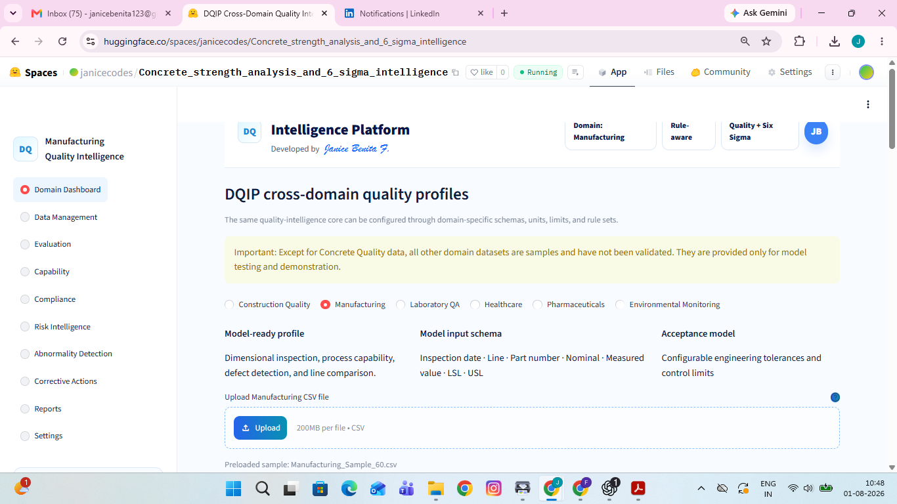
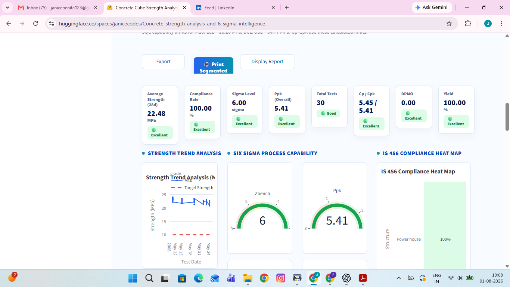
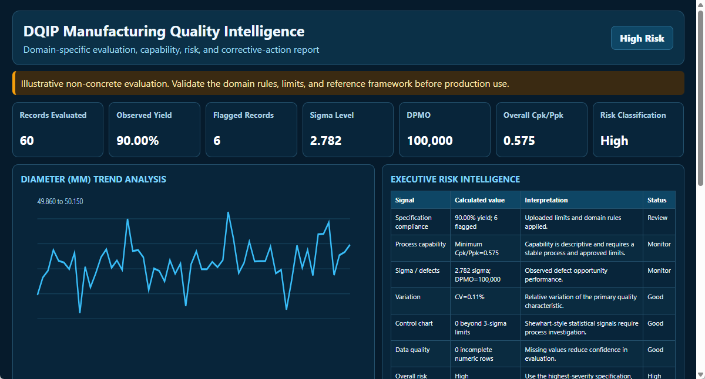
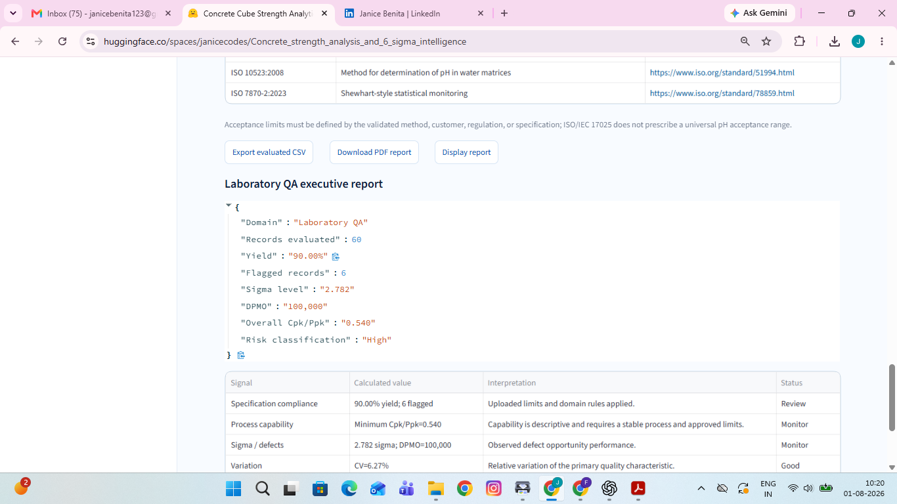
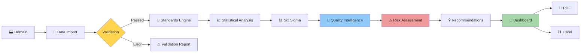
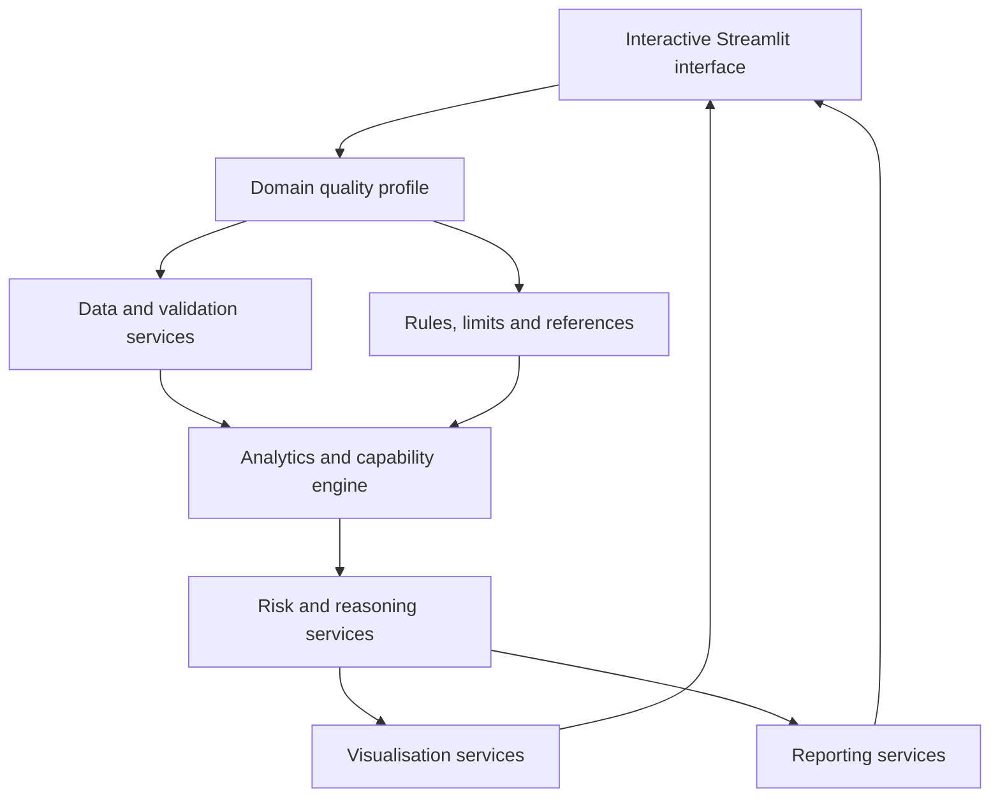

# 📊 DQIP — Digital Quality Intelligence Platform

### AI-powered cross-domain quality intelligence, Six Sigma analytics, risk reasoning and corrective-action support

<p align="center">
  <a href="https://huggingface.co/spaces/janicecodes/Concrete_strength_analysis_and_6_sigma_intelligence"><b>🚀 Launch Live Application</b></a>
  &nbsp;•&nbsp;
  <a href="media/dqip-six-domain-demo.mp4"><b>🎥 Watch Demo Video</b></a>
</p>

<p align="center">
  
  
  
  
</p>

---

## 📌 Project Overview

Quality data is frequently distributed across spreadsheets, laboratory records, inspection reports and independent operational systems. Although these records may confirm whether an individual result passes or fails, they do not always reveal whether the underlying process is stable, capable or moving towards failure.

**DQIP — Digital Quality Intelligence Platform** transforms routine quality records into decision-ready intelligence by combining:

- ✅ Domain-specific quality evaluation
- ✅ Statistical and Six Sigma process analysis
- ✅ Compliance and exception identification
- ✅ Risk intelligence and abnormality detection
- ✅ Possible-cause and corrective-action guidance
- ✅ Interactive engineering dashboards
- ✅ Executive PDF and evaluated-data reporting

The platform uses one reusable analytics core while preserving the correct schema, terminology, units, limits, references, reasons and corrective measures for every selected domain.

> **Important validation statement:** Construction Quality is the validated demonstration workflow. Manufacturing, Laboratory QA, Healthcare, Pharmaceuticals and Environmental Monitoring are illustrative model profiles. Their limits, rules, methods, references and recommendations require independent validation before production use.

---

## 🎯 Why DQIP?

Traditional quality review often stops after checking whether a measured result is inside a specification. That approach can overlook:

- High process variation
- Gradual deterioration or drift
- Supplier, machine, method or location inconsistency
- Weak process capability despite acceptable results
- Repeated abnormal patterns
- Increasing defect risk
- Delayed corrective action

DQIP connects the measurement with its wider process context, helping quality professionals detect concerns earlier and communicate them more clearly.

| Traditional approach | DQIP approach |
|---|---|
| ❌ Separate spreadsheets and manual calculations | ✅ Automated domain-aware evaluation |
| ❌ Pass/fail review alone | ✅ Capability, variation, sigma and risk intelligence |
| ❌ Delayed abnormality recognition | ✅ Early trend and exception identification |
| ❌ Generic corrective-action language | ✅ Domain-specific reasons and recommended measures |
| ❌ Time-consuming report preparation | ✅ Executive dashboards, PDF and evaluated-data export |
| ❌ Dependence on individual interpretation | ✅ Consistent and transparent decision support |

---

## 🌐 Six Domain-Specific Quality Workspaces

### 🏗️ Construction Quality

- Concrete cube-strength evaluation
- 28-day grade-aware acceptance analysis
- Strength trends and coefficient of variation
- Supplier, structure and mix performance
- Statistical process control and abnormality alerts
- ACI/IS-oriented quality intelligence and reporting

### 🏭 Manufacturing

- Dimensional inspection and tolerance compliance
- Nominal, measured, LSL and USL evaluation
- Machine, line, shift and operator comparison
- Process capability and defect intelligence
- Tool wear, calibration and process-drift investigation guidance

### 🔬 Laboratory QA

- Analytical-result and method-limit evaluation
- Instrument, analyst and batch comparison
- Control-limit and exception monitoring
- Repeatability, variation and capability intelligence
- Calibration, reagent, control-sample and method-review guidance

### 🏥 Healthcare Quality

- De-identified operational-quality indicators
- Waiting-time and service-target evaluation
- Department and shift comparison
- Delay, bottleneck and service-variation intelligence
- Operational decision support—not clinical diagnosis

### 💊 Pharmaceutical Quality

- Batch, assay and dissolution evaluation
- Approved specification monitoring
- Product and batch comparison
- Capability and release-quality trend intelligence
- Investigation support for method, material, process and stability concerns

### 🌱 Environmental Monitoring

- pH, turbidity and chlorine monitoring
- Parameter- and location-specific limits
- Site comparison and exceedance detection
- Sampling, instrument and treatment-process investigation guidance
- Monitoring-programme reporting support

---

## 🖥️ Software Screenshots

### Enterprise Domain Selection

Choose a dedicated quality workspace with its own input schema, acceptance model, terminology and dashboard.



### Construction Quality Intelligence Dashboard

Review compliance, strength, sigma performance, capability, yield, DPMO, risk and detailed engineering analytics.



### Manufacturing Quality Intelligence

Evaluate dimensional inspection results, tolerance compliance, capability, process risk and corrective action.



### Domain-Specific Executive Reporting

Generate a report whose title, evidence, quality characteristic, interpretation and corrective measures match the selected domain.



---

## 📊 Key Capabilities

### 📁 Data Management

- Excel and CSV upload
- Preloaded sample datasets
- Domain-specific schema validation
- Data parsing, cleansing and column mapping
- Record-level evaluated status

### 📈 Statistical Quality Analytics

- Mean, standard deviation and variance
- Minimum, maximum, range and coefficient of variation
- Trend and distribution analysis
- Category, supplier, line, instrument, department or location comparison
- Histogram, heat map and control-chart visualisation

### 🎯 Six Sigma and Process Capability

- Sigma level
- Cp, Cpk, Pp and Ppk
- Upper and lower capability indices
- Defect percentage, DPO and DPMO
- Observed process yield
- Process-performance interpretation

### 🚦 Risk and Abnormality Intelligence

- Specification exceptions
- Statistical outliers
- Process drift and sudden changes
- Repeated low or high patterns
- High variation and incomplete data
- Green, Amber, High or Critical risk classification

### 🛠️ Corrective-Action Support

- Plain-language interpretation
- Likely domain-specific reasons
- Immediate containment guidance
- Root-cause investigation prompts
- Corrective and preventive measures
- Effectiveness-verification recommendations

### 📤 Reporting

- Evaluated CSV or Excel export
- Domain-labelled PDF report
- Print-ready executive dashboard
- Evidence, risk and corrective-action summaries
- Standards and reference framework

---

## 🏗️ System Workflow



---

## 🧠 DQIP Architecture



---

## 💼 Engineering and Business Value

DQIP supports:

- Quality engineers and Six Sigma practitioners
- Construction QA/QC teams
- Manufacturing and process engineers
- Laboratory managers and analysts
- Healthcare quality and operations teams
- Pharmaceutical quality professionals
- Environmental monitoring specialists
- Researchers, educators and digital-transformation teams

Potential benefits include faster analysis, earlier risk recognition, more consistent interpretation, traceable corrective action and clearer communication with management, clients and auditors.

---

## 🛠️ Technology Stack

- Python 3.11
- Streamlit
- Pandas and NumPy
- Plotly
- OpenPyXL and xlrd
- ReportLab
- Playwright and Chromium
- Microsoft Edge TTS
- FFmpeg
- Docker

---

## 🚀 Run the Application

### Local installation

```bash
python -m venv .venv
pip install -r requirements.txt
python -m playwright install chromium
streamlit run app.py
```

Open `http://localhost:8501`.

### Docker

```bash
docker build -t dqip .
docker run --rm -p 8501:8501 dqip
```

### Live application

👉 [Launch DQIP on Hugging Face Spaces](https://huggingface.co/spaces/janicecodes/Concrete_strength_analysis_and_6_sigma_intelligence)

---

## 🎥 Platform Demonstration

👉 [Watch or download the six-minute DQIP demonstration](media/dqip-six-domain-demo.mp4)

The demonstration presents the software workflow across all six quality domains. It is included as supporting product media; the repository documentation remains focused on the software and its quality-intelligence capabilities.

---

## 🔭 Future Vision

- Validated domain rule libraries
- User-configurable specifications and references
- Predictive quality and early-warning models
- Explainable AI-assisted investigation
- Supplier, machine, instrument and site risk scoring
- LIMS, MES, ERP and IoT integration
- Role-based access, audit trails and enterprise reporting
- Digital-twin and real-time quality monitoring

---

## 👩‍💻 Developed By

**Janice Benita F.**<br>
B.Tech Information Technology

Areas of interest:

- Artificial Intelligence
- Explainable AI
- Data Analytics
- Quality Engineering
- Industrial AI Applications
- Digital Transformation

- [GitHub](https://github.com/Janicebenita)
- [LinkedIn](https://linkedin.com/in/janice13)

---

## 🤝 Feedback and Collaboration

Quality professionals, engineers, laboratory specialists, healthcare operations teams, pharmaceutical experts, environmental analysts, researchers and digital-transformation leaders are invited to explore DQIP and provide feedback.

**Which quality domain should be developed and validated next?**

---

## 📜 License

This project is licensed under the MIT License. Domain standards and referenced publications remain the property of their respective organisations.

---

### 🏆 Built for data-driven, cross-domain quality excellence

**Transforming quality records into transparent, actionable and defensible intelligence.**
