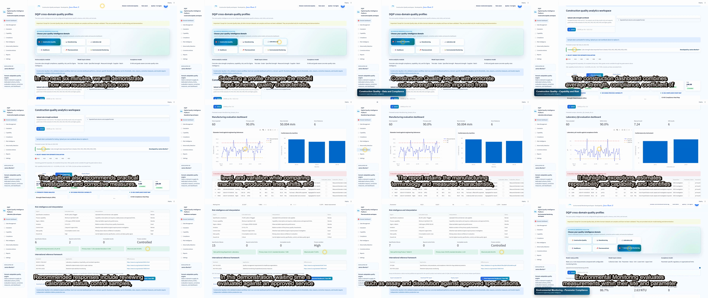
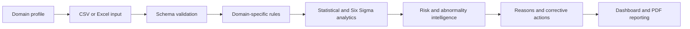
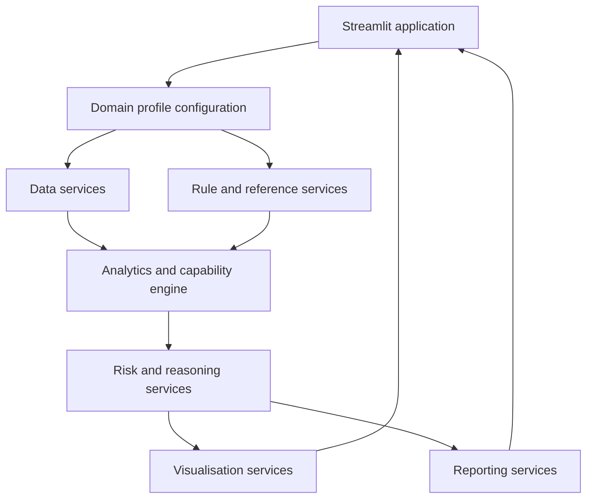

# DQIP — Digital Quality Intelligence Platform

### Cross-domain quality analytics, Six Sigma intelligence, risk reasoning, corrective action, and executive reporting

**Developed by Janice Benita F.**

[](https://huggingface.co/spaces/janicecodes/Concrete_strength_analysis_and_6_sigma_intelligence)
[](https://www.python.org/)
[](https://streamlit.io/)
[](#license)

## Overview

DQIP is a configurable decision-support platform that converts engineering, laboratory, operational, pharmaceutical, and environmental quality data into actionable intelligence.

The platform uses one reusable analytics core while preserving the schema, terminology, units, acceptance limits, risk interpretation, standards context, likely causes, corrective measures, and report language required by each quality domain.

> **Validation statement:** Construction Quality is the validated demonstration workflow. Manufacturing, Laboratory QA, Healthcare, Pharmaceuticals, and Environmental Monitoring are illustrative model profiles. Their methods, limits, calculations, references, and recommendations require independent validation before production use.

## Six-domain platform demonstration

[▶ Download or watch the six-minute DQIP demonstration](media/dqip-six-domain-demo.mp4)



## Quality domains

| Domain | Demonstrated characteristic | Example intelligence |
|---|---|---|
| Construction Quality | 28-day concrete cube strength | Grade compliance, strength variation, supplier and mix performance |
| Manufacturing | Dimensional inspection | Tolerance compliance, machine and line comparison, tool or process drift |
| Laboratory QA | Analytical pH result | Instrument comparison, method limits, exceptions and repeatability |
| Healthcare | Operational waiting time | Service-target compliance, department and shift performance |
| Pharmaceuticals | Assay and dissolution | Batch and product compliance, specification risk and release-quality trends |
| Environmental Monitoring | pH, turbidity and chlorine | Parameter limits, site trends, exceedances and monitoring risk |

Each profile includes its own preloaded demonstration dataset and accepts a domain-specific CSV or Excel upload.

## Core capabilities

- Domain-aware input validation and schema mapping
- Interactive trend, distribution and comparison charts
- Mean, standard deviation, variance, range and coefficient of variation
- Cp, Cpk, Pp, Ppk and related process-capability measures
- Sigma level, observed yield, defect rate and DPMO
- Statistical process-control and abnormality signals
- Compliance and exception identification
- Plain-language risk classification and interpretation
- Possible-cause analysis and domain-specific corrective measures
- Evaluated CSV or Excel export
- Domain-labelled PDF reports and print-ready executive dashboards
- Transparent standards references and validation boundaries

## DQIP workflow



## Architecture



## AI Storytelling Video Generator

DQIP includes a one-click multimedia demonstration system. Select **Generate AI Demo Video** from the sidebar to automatically:

1. Start an isolated local DQIP session.
2. Use Playwright to navigate through all six domains.
3. Load the supplied sample data and perform realistic interactions.
4. Record scrolling, clicks, chart focus, dashboards and reports.
5. Generate professional Indian-English female narration using Microsoft Edge TTS.
6. Create synchronized SRT subtitles.
7. Add an original low-volume corporate music bed with narration ducking.
8. Render a presentation-ready MP4 without manual editing.

Generated outputs:

- `demo_storytelling_video.mp4`
- `demo_storytelling_video.srt`
- `voice.wav`

Video specification: **1920 × 1080, 30 FPS, H.264 video and AAC audio**.

## Technology stack

- Python 3.11
- Streamlit
- Pandas and NumPy
- Plotly
- OpenPyXL and xlrd
- ReportLab
- Playwright and Chromium
- Microsoft Edge TTS
- FFmpeg and imageio-ffmpeg

## Repository structure

```text
.
├── app.py                    # Streamlit user interface and domain dashboards
├── analytics.py              # Concrete analytics and capability calculations
├── storytelling.py          # One-click video-generation orchestrator
├── screen_recorder.py        # Playwright browser automation and recording
├── voice_generator.py        # Indian-English narration and corporate music
├── subtitle_generator.py     # Narration-synchronised SRT generation
├── video_renderer.py         # H.264/AAC composition and subtitle burn-in
├── scene_manager.py          # Scene models and timeline control
├── sample_script.py          # Six-domain narration and visual plan
├── sample_data/              # Domain-specific CSV demonstrations
├── SQC Data.xls              # Concrete-quality sample workbook
├── requirements.txt
└── Dockerfile
```

## Run locally

### Standard Python environment

```bash
python -m venv .venv
```

Activate the virtual environment, then install the dependencies:

```bash
pip install -r requirements.txt
python -m playwright install chromium
streamlit run app.py
```

Open `http://localhost:8501`.

FFmpeg must be installed and available on `PATH` when running outside Docker.

### Docker

```bash
docker build -t dqip .
docker run --rm -p 8501:8501 dqip
```

The Docker image installs FFmpeg and Playwright Chromium automatically.

## Data guidance

- Use authorised, de-identified and quality-controlled data only.
- Confirm units and specification limits before interpreting results.
- Do not use illustrative profiles for regulated or safety-critical decisions without validation.
- Healthcare demonstrations are operational and are not intended for clinical diagnosis.
- Review every recommended corrective action with an authorised domain specialist.

## Intended users

- Quality engineers and Six Sigma practitioners
- Construction QA/QC teams
- Manufacturing and process engineers
- Laboratory managers and analysts
- Healthcare quality and operations teams
- Pharmaceutical quality professionals
- Environmental monitoring specialists
- Researchers, educators and digital-transformation teams

## Roadmap

- Validated domain rule libraries
- User-configurable specifications and reference frameworks
- Predictive quality and early-warning models
- Role-based access and audit trails
- Database, LIMS, MES and IoT integrations
- Scheduled enterprise reporting
- Explainable AI-assisted investigation workflows

## Author

**Janice Benita F.**<br>
B.Tech Information Technology

- [GitHub](https://github.com/Janicebenita)
- [LinkedIn](https://linkedin.com/in/janice13)

Feedback and collaboration from quality professionals, engineers, researchers and domain specialists are welcome.

## License

This project is licensed under the MIT License. Domain standards and referenced publications remain the property of their respective organisations.
